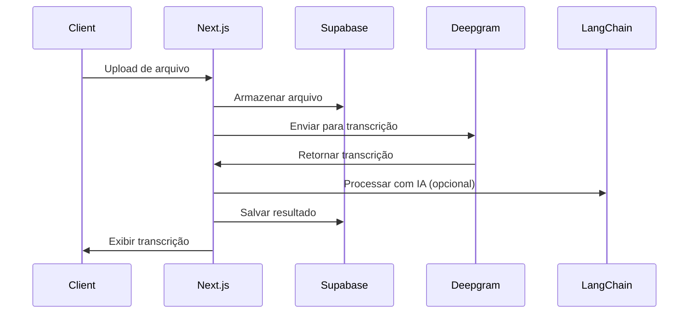
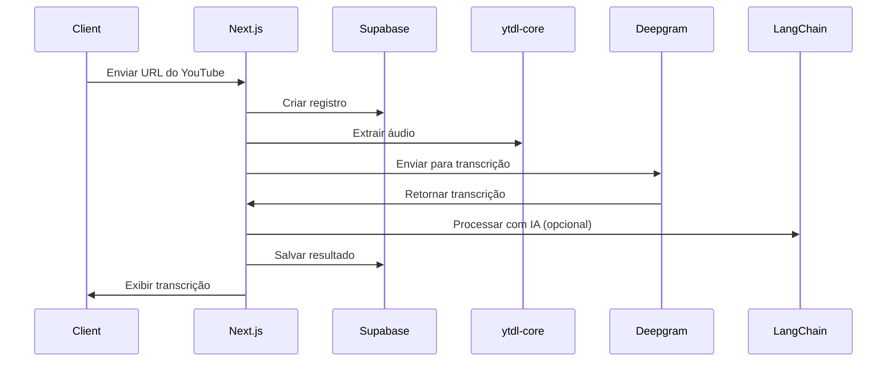
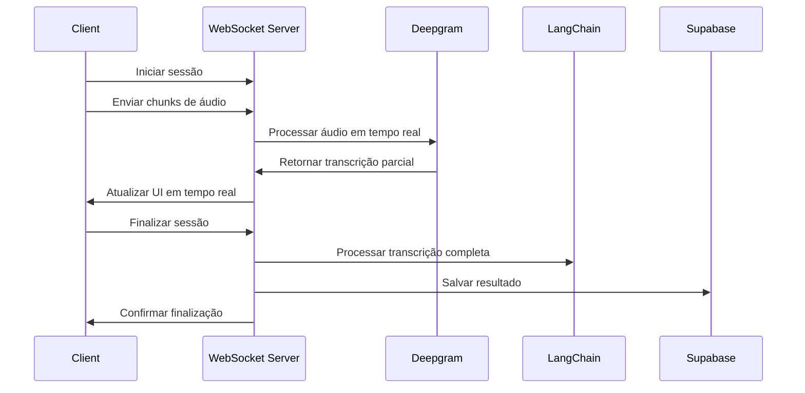
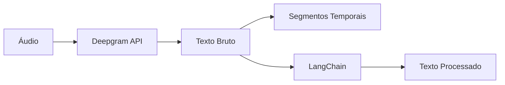
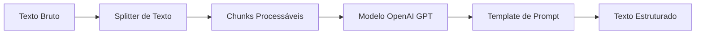

# MeetingsTranscript

Uma aplicação avançada para transcrição de áudio e vídeo usando IA, construída com Next.js, Supabase, Stripe e LangChain.

## Visão Geral da Implementação

A aplicação MeetingsTranscript foi desenvolvida como uma solução completa para transcrição de conteúdo de áudio com processamento inteligente utilizando IA. A arquitetura foi projetada seguindo princípios de escalabilidade, separação de responsabilidades e performance.

### Arquitetura do Sistema

```
┌─────────────────┐     ┌─────────────────┐     ┌─────────────────┐
│                 │     │                 │     │                 │
│  Next.js App    │◄────┤   API Routes    │◄────┤  Supabase DB    │
│   (Frontend)    │     │   (Backend)     │     │  (PostgreSQL)   │
│                 │     │                 │     │                 │
└────────┬────────┘     └────────┬────────┘     └─────────────────┘
         │                       │
         │                       │
         ▼                       ▼
┌─────────────────┐     ┌─────────────────┐     ┌─────────────────┐
│                 │     │                 │     │                 │
│   WebSocket     │     │ Deepgram API/   │     │    Stripe       │
│    Server       │     │   LangChain     │     │   Payment       │
│                 │     │                 │     │                 │
└─────────────────┘     └─────────────────┘     └─────────────────┘
```

### Componentes Principais

1. **Frontend (Next.js):** Interface do usuário construída com React e componentes Shadcn UI, proporcionando experiência moderna e responsiva.

2. **Backend (API Routes do Next.js):** Gerencia a lógica de negócios, processamento de transcrições e integrações.

3. **Banco de Dados (Supabase/PostgreSQL):** Armazena dados de usuários, transcrições e metadados com esquema relacional otimizado.

4. **WebSocket Server:** Servidor dedicado para transcrição em tempo real usando Socket.io.

5. **Pipeline de IA:** Integração com Deepgram para transcrição e LangChain/OpenAI para processamento de texto.

6. **Sistema de Pagamentos:** Integração com Stripe para gerenciamento de assinaturas.

## Fluxos de Transcrição

A aplicação suporta três fluxos principais de transcrição:

### 1. Transcrição de Arquivos de Áudio



- **Implementação:** Arquivo enviado para `/api/transcribe/file`, que o armazena no Supabase Storage e processa de forma assíncrona
- **Tecnologias:** Fetch API, Deepgram REST API, Sistema de armazenamento de arquivos do Supabase

### 2. Transcrição de Vídeos do YouTube



- **Implementação:** URL enviada para `/api/transcribe/youtube`, que extrai o áudio utilizando ytdl-core e realiza a transcrição
- **Tecnologias:** ytdl-core, fluent-ffmpeg, Deepgram REST API

### 3. Transcrição ao Vivo



- **Implementação:** Servidor WebSocket dedicado com Socket.io recebe streams de áudio do navegador e usa Deepgram para transcrever em tempo real
- **Tecnologias:** Socket.io, WebSockets, MediaRecorder API, Deepgram REST API

## Integração Supabase com Stripe

A integração entre Supabase e Stripe gerencia o sistema de assinaturas e pagamentos, permitindo planos diferenciados.

### Fluxo de Pagamento

1. **Cadastro de Cliente:**
   - Ao registrar um usuário, criamos automaticamente um perfil na tabela `profiles`
   - A trigger `handle_new_user` no PostgreSQL gerencia essa operação

2. **Assinatura de Plano:**
   - Quando o usuário escolhe um plano, redirecionamos para Stripe Checkout
   - URL de checkout gerada via API Route `/api/stripe/create-checkout`
   - O plano escolhido é passado como metadado para o Stripe

3. **Processamento de Pagamento:**
   - Após pagamento bem-sucedido, Stripe envia webhook para `/api/stripe/webhook`
   - O webhook atualiza o status da assinatura no Supabase
   - Atualizamos o campo `has_active_subscription` e `stripe_customer_id` no perfil

4. **Gestão de Limites:**
   - Cada rota de API verifica os limites do usuário com base no plano
   - Usuários gratuitos: 5 transcrições por mês, áudios de até 10 minutos
   - Assinantes: Limites expandidos conforme o plano

### Esquema de Dados

```sql
-- Perfil com informações de assinatura
CREATE TABLE profiles (
  id UUID PRIMARY KEY REFERENCES auth.users(id) ON DELETE CASCADE,
  stripe_customer_id TEXT,
  has_active_subscription BOOLEAN DEFAULT FALSE,
  ...
);

-- Row Level Security (RLS)
CREATE POLICY "Usuários podem ver apenas seus próprios perfis"
ON profiles FOR SELECT
USING (auth.uid() = id);
```

## Pipelines de IA e Integração com UI

### Transcrição com Deepgram



- **Implementação:** Usamos a API REST do Deepgram para conversão de áudio para texto
- **Features avançadas:** Diarização (identificação de falantes), pontuação inteligente, formatação
- **Performance:** Processamento servidor-side para operações pesadas, UI atualizada em tempo real

### Processamento com LangChain e OpenAI



- **Implementação:** Usamos LangChain para orquestrar o processamento avançado do texto
- **Pipeline LangChain:** `RunnableSequence` com `PromptTemplate` + `ChatOpenAI` + `StringOutputParser`
- **Personalização:** Processamento baseado em prompts do usuário (ex: "Extrair ações", "Resumir pontos principais")

### Integração com UI

- **Componentes Reativos:** A UI é atualizada em tempo real durante gravação ao vivo
- **Gerenciamento de Estado:** Feedback visual do processo de transcrição
- **Visualização:** Exibição de texto bruto e processado, navegação por segmentos temporais
- **Exportação:** Possibilidade de exportar em formatos como texto ou PDF

## Performance e Multiusuários

### Arquitetura Escalável

1. **Processamento Assíncrono:**
   - Transcrições de arquivos e YouTube são processadas em background usando `setTimeout` (em produção seria via sistema de filas)
   - Resposta imediata ao cliente enquanto processamento acontece no servidor

2. **Servidor WebSocket Dedicado:**
   - Separação do servidor WebSocket do servidor Next.js
   - Permite escalar independentemente para suportar mais conexões simultâneas

3. **Gerenciamento de Conexões:**
   - Mapeamento de conexões ativas com `activeTranscriptions`
   - Limpeza de recursos quando sessões terminam

4. **Armazenamento Otimizado:**
   - Arquivos temporários são limpos após processamento
   - Segmentos de transcrição armazenados eficientemente no banco de dados

5. **Segurança Multiusuário:**
   - Row Level Security (RLS) no Supabase garante isolamento de dados
   - Usuários só podem acessar suas próprias transcrições

### Otimizações Implementadas

- **Streaming de Áudio:** Envio em chunks pequenos (1 segundo) para processamento rápido
- **Caching:** Aproveitamento do cache do Next.js para páginas estáticas
- **Lazy Loading:** Carregamento sob demanda de componentes pesados
- **Segmentação de Dados:** Paginação para listagens de transcrições
- **Limitação por Plano:** Controle de uso de recursos baseado no plano do usuário

## Requisitos para Produção

A aplicação está pronta para uso em desenvolvimento e pode ser colocada em produção com algumas considerações importantes:

### 1. Infraestrutura

- **Hospedagem de Next.js:** Vercel ou similar com suporte a Edge Functions
- **Servidor WebSocket:** Serviço dedicado como Heroku, Railway ou EC2
- **Armazenamento:** Garantir configuração correta do Supabase Storage

### 2. Segurança

- **Variáveis de Ambiente:** Todas as chaves de API devem ser configuradas
- **CORS:** Configuração segura para comunicação entre serviços
- **Rate Limiting:** Implementar limitação de requisições para evitar abusos
- **Validação de Entrada:** Validar todos os dados de entrada com zod ou similar
- **Autenticação Robusta:** Configurar corretamente as opções de segurança do Supabase

### 3. Monitoramento

- **Logging:** Implementar sistema de logging mais robusto (Sentry, LogRocket)
- **Métricas:** Monitorar uso de recursos e performance
- **Alertas:** Configurar alertas para falhas e degradação de desempenho

### 4. Melhorias Sugeridas

- **Sistema de Filas:** Substituir `setTimeout` por um sistema de filas como Bull/Redis
- **Worker Threads:** Processamento em threads separadas para tarefas intensivas
- **Testes Automatizados:** Implementar testes unitários e de integração
- **CI/CD:** Pipeline de integração e deploy contínuo
- **CDN:** Configurar CDN para ativos estáticos e arquivos de áudio

## Tecnologias Utilizadas

- **Frontend:** Next.js 14, TailwindCSS, Shadcn UI, Socket.io Client
- **Backend:** Next.js API Routes, Socket.io Server
- **Database:** Supabase (PostgreSQL)
- **IA:** Deepgram, LangChain, OpenAI
- **Pagamentos:** Stripe
- **Media:** ytdl-core, fluent-ffmpeg, MediaRecorder API

## Configuração

Para executar a aplicação, configure as variáveis de ambiente em um arquivo `.env.local`:

```
# Supabase
NEXT_PUBLIC_SUPABASE_URL=sua_url_supabase
NEXT_PUBLIC_SUPABASE_ANON_KEY=sua_chave_anon
SUPABASE_SERVICE_ROLE_KEY=sua_chave_service_role

# OpenAI
OPENAI_API_KEY=sua_chave_openai

# Deepgram
DEEPGRAM_API_KEY=sua_chave_deepgram

# Stripe
STRIPE_SECRET_KEY=sua_chave_stripe
STRIPE_WEBHOOK_SECRET=seu_webhook_secret
NEXT_PUBLIC_STRIPE_PUBLISHABLE_KEY=sua_chave_publica_stripe

# App
NEXT_PUBLIC_APP_URL=http://localhost:3000
SOCKET_PORT=3001
```

Inicie o aplicativo com:

```bash
npm run dev
```

Isso iniciará o servidor Next.js na porta 3000 e o servidor WebSocket na porta 3001 simultaneamente.
