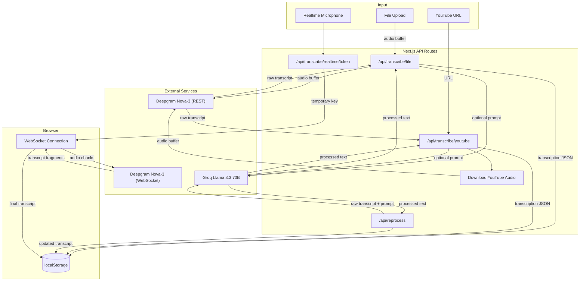

# Meetings Transcript

Audio and video transcription application powered by AI. Supports file uploads, YouTube URLs, and realtime microphone recording with speech-to-text via Deepgram Nova-3 and optional AI processing through Groq Llama 3.3 70B.

Built as a self-contained showcase application with no external database -- all data is stored client-side in localStorage.

## Architecture

Next.js API routes handle all audio processing server-side: receiving uploads, downloading YouTube audio, creating temporary Deepgram keys for realtime sessions, and calling the Groq LLM for AI processing. The client stores all transcription results in localStorage and manages the realtime microphone WebSocket connection directly with Deepgram.

```
Browser (Client)                         Server (API Routes)                    External Services
-------------------                      -------------------                    ------------------
Landing Page                             POST /api/transcribe/file              Deepgram Nova-3 (STT)
Dashboard (list)                         POST /api/transcribe/youtube           Groq Llama 3.3 70B (LLM)
New Transcription Form                   POST /api/reprocess                    YouTube (audio download)
Transcription Detail                     POST /api/transcribe/realtime/token
localStorage (persistence)
```

The realtime path is different from file and YouTube: the browser opens a WebSocket directly to Deepgram using a short-lived temporary API key issued by the server. Audio chunks from the microphone are streamed over this WebSocket, and transcript fragments are received back in real time.

## Pipeline



### Stage 1: Speech-to-Text (Deepgram)

Audio is sent to the Deepgram Nova-3 model. For file uploads and YouTube, this is a single REST POST with the full audio buffer. For realtime, the browser streams audio chunks over a WebSocket using a temporary API key (10-second TTL) created by the server. The API returns raw transcript text with word-level timestamps, speaker diarization, smart formatting, and punctuation.

File/YouTube configuration: `model=nova-2, language=pt-BR, smart_format=true, punctuate=true, diarize=true`.
Realtime configuration: `model=nova-3, language=pt-BR, smart_format=true, punctuate=true, interim_results=true, endpointing=300, vad_events=true`.

### Stage 2: LLM Processing (Groq)

This stage is optional and triggered only when the user provides a custom prompt (e.g., "extract action items", "summarize key decisions", "list topics discussed"). The raw transcript is sent to Groq's Llama 3.3 70B model with `temperature=0.5`. A system prompt instructs the model to analyze and organize the transcription content according to the user's instructions. Users can reprocess any completed transcription with a different prompt at any time without re-transcribing the audio.

## Input Methods

**File Upload** -- Drag-and-drop or browse for audio files. Supports MP3, WAV, M4A, OGG, FLAC, WebM, and AAC formats up to 50MB. The file is sent as a buffer to Deepgram's REST API for batch transcription.

**YouTube URL** -- Paste any public YouTube video URL. The server downloads the audio track using `@distube/ytdl-core` (capped at 200MB / approximately 2 hours), buffers it in memory, and sends it to Deepgram for transcription.

**Realtime Microphone** -- Record directly from the browser microphone with live transcription. The server issues a short-lived Deepgram API key (10-second TTL) so the browser can open a WebSocket connection directly to Deepgram. Audio is captured via MediaRecorder and streamed in 250ms chunks. Interim and final transcript results appear in real time. Sessions are capped at 3 minutes with a 30-second cooldown between sessions and a maximum of 5 concurrent sessions globally.

## Tech Stack

| Component | Technology | Role |
|-----------|-----------|------|
| Framework | Next.js 16 (App Router, Turbopack) | Server-side API routes and static rendering |
| UI | React 19, Tailwind CSS 4, Radix UI, Shadcn UI | Component library and styling |
| Language | TypeScript 5.7 | Type safety across client and server |
| Speech-to-Text | Deepgram Nova-3 API | Audio transcription (REST and WebSocket) |
| LLM Processing | Groq Llama 3.3 70B | Optional AI summarization and analysis |
| YouTube Audio | @distube/ytdl-core | Download audio from YouTube videos |
| Storage | Browser localStorage | Client-side transcription persistence |
| Theming | next-themes | System, dark, and light mode support |
| Deployment | Docker (Node.js 20 Alpine) + Traefik | Containerized with automatic HTTPS |

## Getting Started

### Prerequisites

- Node.js 20+
- A [Deepgram](https://deepgram.com) API key (free tier available)
- A Deepgram Project ID (required for realtime temporary key generation)
- A [Groq](https://console.groq.com) API key (free tier available)

### Environment Variables

Create a `.env` file in the project root:

```
DEEPGRAM_API_KEY=your_deepgram_api_key
DEEPGRAM_PROJECT_ID=your_deepgram_project_id
GROQ_API_KEY=your_groq_api_key
```

`DEEPGRAM_API_KEY` -- Used for file and YouTube transcription (REST API) and for creating temporary keys for realtime sessions.

`DEEPGRAM_PROJECT_ID` -- Required by the Deepgram key management API to issue short-lived keys for realtime WebSocket connections.

`GROQ_API_KEY` -- Used for optional AI processing of transcripts. If not set, AI processing is skipped and raw transcripts are returned.

### Running Locally

```bash
npm install
npm run dev
```

Open http://localhost:3000.

### Running with Docker

```bash
# Set your API keys in .env
cp .env.example .env
# Edit .env with your keys

# Build and start
docker compose up -d

# Check logs
docker compose logs -f
```

The container runs as a non-root user, uses the Next.js standalone output for minimal image size, and includes a health check on port 3000. The Docker Compose file is preconfigured for Traefik reverse proxy with automatic HTTPS via Let's Encrypt.

## Rate Limits

All rate limits are per-IP and enforced in-memory (appropriate for a single-instance showcase).

| Endpoint | Limit | Window |
|----------|-------|--------|
| `POST /api/transcribe/file` | 10 requests | 1 hour |
| `POST /api/transcribe/youtube` | 5 requests | 1 hour |
| `POST /api/reprocess` | 15 requests | 1 hour |
| `POST /api/transcribe/realtime/token` | 5 concurrent sessions globally, 30s cooldown per IP | Rolling |
