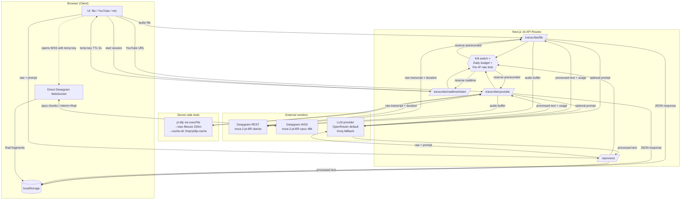

# Meetings Transcript

Audio and video transcription showcase. Three input pipelines (file upload, YouTube URL, realtime microphone) feed Deepgram for speech-to-text and an optional LLM step for prompt-driven summarization or analysis. No database: transcriptions are persisted client-side in `localStorage`. Built with Next.js 16 App Router and deployed as a single hardened container behind Traefik.

## Overview

The application exposes four Next.js API routes — `transcribe/file`, `transcribe/youtube`, `transcribe/realtime/token`, and `reprocess` — all of which guard vendor calls behind a daily budget, a global kill switch, and per-IP rate limiting. The browser holds all transcription state; the server is stateless apart from in-memory rate-limit counters and a file-backed budget ledger on a Docker volume.

## Pipelines

### File upload
The browser POSTs `multipart/form-data` (audio + title + optional prompt) to `/api/transcribe/file`. The route validates the file type and size (50 MB cap), reserves prerecorded budget, sends the buffer to the Deepgram REST endpoint with `audio/mp3` content-type, and finalizes the budget reservation against the actual `metadata.duration` returned by Deepgram. If a prompt is present, the raw transcript is forwarded to the LLM provider; the result, plus the raw transcript, is returned to the client.

### YouTube URL
The browser POSTs `{ title, youtubeUrl, prompt? }` to `/api/transcribe/youtube`. After validation, the route reserves budget and shells out to the system `yt-dlp` binary via `execFile` to download the audio track to `/tmp` (capped at 200 MB / ~2 hours, no playlist, no cache directory writes outside `/tmp/ytdlp-cache`). The resulting buffer is sent to Deepgram exactly like a file upload.

### Realtime microphone
The browser asks `/api/transcribe/realtime/token` for a short-lived Deepgram key (TTL 5 s, scope `member`, tagged `realtime-showcase-temp`), then opens a WebSocket directly to `wss://api.deepgram.com/v1/listen` and streams Opus chunks captured from `MediaRecorder`. The server is no longer in the audio path. A session is capped at 3 minutes, with a 30-second per-IP cooldown and at most 5 concurrent sessions globally.

## Architecture



## Tech stack

Versions taken from `package.json`:

| Layer | Choice | Notes |
|---|---|---|
| Framework | Next.js 16.1.4 (App Router, Turbopack dev) | Standalone output for Docker |
| Language | TypeScript 5.7 | Strict on both client and server |
| UI | React 19, Tailwind CSS 4, Radix primitives, shadcn-style components, `lucide-react`, `next-themes` | Dark / light / system |
| STT | Deepgram | `nova-2` for prerecorded REST, `nova-3` for realtime WebSocket, both `pt-BR`, smart format + punctuate; prerecorded adds diarization, realtime adds VAD events and 200 ms endpointing |
| LLM SDK | `openai` 4.77 (default, pointed at OpenRouter `https://openrouter.ai/api/v1`) and `groq-sdk` 0.37 (rollback) | Single `groq.ts` module abstracts both — filename kept for import-site stability |
| YouTube audio | System `yt-dlp` binary, called via `child_process.execFile` | `ffmpeg` + `python3` installed in the runner image |
| Concurrency primitive | `async-mutex` | Serializes budget read/write |
| Persistence | Browser `localStorage` | No DB, no server-side user state |
| Reverse proxy | Traefik v3 with Let's Encrypt | CSP, HSTS, Permissions-Policy injected at the edge |

`@distube/ytdl-core` is still listed as a dependency from the previous implementation but is no longer used at runtime — the production path is `yt-dlp`.

## Cost-control and safety

This is a public showcase with my own API keys behind it, so multiple layers exist specifically to bound the worst case.

- **Daily budget (`src/lib/budget.ts`).** A JSON ledger persisted to `/data/budget.json` (Docker volume) with three buckets and hard UTC-day ceilings: `deepgram-realtime` 1800 s, `deepgram-prerecorded` 14400 s, and `groq` 500000 tokens (the bucket name is internal and applies to whichever LLM provider is active). Each route uses **reserve-then-finalize** semantics: it reserves a conservative estimate before calling the vendor, then on success or failure adjusts the counter to the real measured cost (`metadata.duration` from Deepgram, `usage.total_tokens` from the LLM). All reads and writes are serialized through an `async-mutex`. When a bucket is full, the route returns HTTP 503 with `Retry-After` set to seconds-until-midnight-UTC.
- **Global kill switch.** `DEEPGRAM_KILL_SWITCH=1` forces every transcription route (`file`, `youtube`, `realtime/token`) to return 503 immediately, before any vendor call or budget check. Toggle without redeploy by editing the env and restarting the container.
- **Realtime token hardening (`src/app/api/transcribe/realtime/token/route.ts`).** Temporary Deepgram keys are issued with scope `member` and a 5-second TTL, tagged so they show up cleanly in Deepgram's audit log. The browser must use the key immediately to open the WebSocket; long-lived theft is bounded by TTL.
- **IP detection (`src/lib/rate-limiter.ts`).** Client IP is read **only** from `x-real-ip`, which Traefik is configured to set authoritatively. `x-forwarded-for` is ignored because it is user-spoofable. Requests without a usable IP collapse into an `unknown` bucket with the same per-IP cooldowns.
- **Per-IP rate limits.** In-memory rolling windows per route — appropriate for a single-instance showcase. `transcribe/file` 10/h, `transcribe/youtube` 5/h, `reprocess` 15/h, and `transcribe/realtime/token` enforces 30 s per-IP cooldown plus 5 concurrent sessions globally.
- **Log redaction (`src/lib/log-sanitize.ts`).** Every error-path `console.*` in `deepgram.ts`, `groq.ts`, the routes, and the `yt-dlp` stderr capture passes strings through `sanitize()`, which redacts `Token <key>`, `Bearer <token>`, `gsk_*`, `sk_test_*` / `sk_live_*`, and Deepgram-style 40-char hex fingerprints starting with `3ae33e`.
- **LLM provider abstraction (`src/lib/ai/groq.ts`).** Default is OpenRouter with `deepseek/deepseek-chat` (cost), with `LLM_PROVIDER=groq` as a documented rollback path. The OpenRouter client sends `HTTP-Referer` and `X-Title` so usage shows up tagged in their dashboard. If neither key is set, the LLM step is skipped and the raw transcript is returned with `ai_skipped: true`.
- **Container hardening (`Dockerfile`).** A `prebuild` hook in `package.json` refuses to build on the host (`IN_DOCKER_BUILD` guard) — this stops `.env` from leaking into a bundled standalone build. The Dockerfile also runs `find .next/standalone -name '.env*' -delete` after the build as belt-and-suspenders. The runner stage drops to a non-root `nextjs` user (uid 1001), pre-creates `/home/nextjs`, `/tmp/ytdlp-cache`, and `/data` with the correct ownership, and sets `XDG_CACHE_HOME` to `/tmp/ytdlp-cache` so `yt-dlp` cannot write outside its sandbox.
- **Edge headers (Traefik labels in `docker-compose.yml`).** Strict `Content-Security-Policy` with `connect-src 'self' wss://api.deepgram.com https://api.deepgram.com` so the browser can only WebSocket to Deepgram, plus `Permissions-Policy: microphone=(self), camera=(), geolocation=()`, HSTS preload, `frameDeny`, `nosniff`, `referrer-policy strict-origin-when-cross-origin`, and a global rate-limit + server-header strip.

## Local development

Prerequisites: Node.js 20+, a Deepgram API key, a Deepgram project ID (required to mint realtime temp keys), and either an OpenRouter or a Groq API key.

```bash
cp .env.example .env
# Edit .env with your keys (see "Environment variables" below)
npm install
npm run dev
```

Open `http://localhost:3000`. Note that `npm run build` will refuse to run on the host — see Deployment below. For tests:

```bash
npm test
```

## Deployment

The production path is Docker only. The host build is intentionally blocked by a `prebuild` guard in `package.json` (`IN_DOCKER_BUILD=1` is set inside the Dockerfile builder stage), which prevents accidentally bundling host `.env` files into a standalone deploy.

```bash
cp .env.example .env
# Edit .env

docker compose up -d --build
docker compose logs -f
```

The compose file is wired for the `pgdev.com.br` Traefik network (`networks.proxy` external) and exposes the app at `https://transcripts.pgdev.com.br` with auto-issued Let's Encrypt certs. The `transcripts-budget` named volume is mounted at `/data` and persists the daily budget ledger across container restarts.

## Environment variables

| Variable | Required | Default | Purpose |
|---|---|---|---|
| `DEEPGRAM_API_KEY` | Yes | — | Used for prerecorded REST calls and to mint realtime temp keys |
| `DEEPGRAM_PROJECT_ID` | Yes (for realtime) | — | Project under which temp keys are created |
| `DEEPGRAM_KILL_SWITCH` | No | `0` | Set to `1` to force 503 on every transcription route |
| `LLM_PROVIDER` | No | `openrouter` | `openrouter` or `groq` |
| `LLM_MODEL` | No | `deepseek/deepseek-chat` | Used when provider is OpenRouter |
| `OPENROUTER_API_KEY` | If `LLM_PROVIDER=openrouter` | — | Sent as bearer token to `https://openrouter.ai/api/v1` |
| `GROQ_API_KEY` | If `LLM_PROVIDER=groq` | — | Used when rolling back to Groq |
| `GROQ_MODEL` | No | `llama-3.3-70b-versatile` | Used only when provider is Groq |
| `BUDGET_DIR` | No | `/data` | Directory for the budget ledger; the Docker volume mounts here |

If no LLM key is configured, the LLM step is skipped silently and the response carries `ai_skipped: true`.
