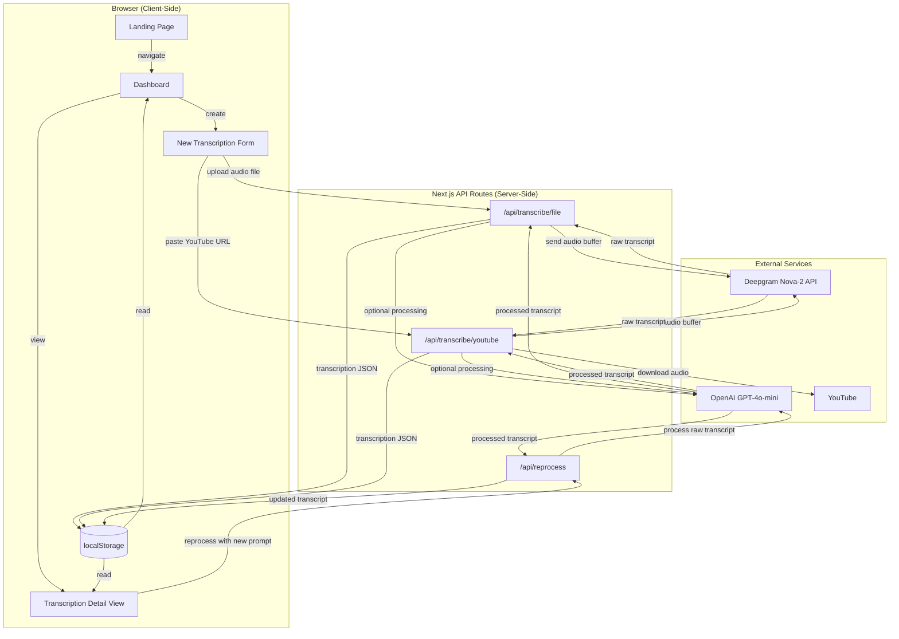

# MeetingsTranscript

Audio and video transcription application powered by AI. Upload audio files or paste a YouTube URL to get accurate transcriptions with optional AI-powered processing using custom prompts.

Built as a self-contained showcase application with no external database -- all data is stored client-side in localStorage.

## Architecture



## How the AI Pipeline Works

The application uses a two-stage AI pipeline to transform audio into structured, actionable text.

### Stage 1: Speech-to-Text (Deepgram)

Audio is sent to the Deepgram Nova-2 model configured for Brazilian Portuguese (`pt-BR`). The API returns a raw transcript with word-level timestamps, speaker diarization, smart formatting, and punctuation. For YouTube videos, the audio is first extracted from the video stream using `ytdl-core` and buffered in memory before being sent to Deepgram.

Configuration: `model=nova-2`, `language=pt-BR`, `smart_format=true`, `punctuate=true`, `diarize=true`.

### Stage 2: LLM Processing (OpenAI via LangChain)

This stage is optional and triggered only when the user provides a custom prompt (e.g., "extract action items", "summarize key decisions", "list topics discussed"). The raw transcript is fed into a LangChain `RunnableSequence` chain composed of:

1. **PromptTemplate** -- injects the raw transcript and user instructions into a system prompt that guides the model to analyze and organize the content.
2. **ChatOpenAI** -- calls GPT-4o-mini with `temperature=0.5` for a balance between creativity and consistency.
3. **StringOutputParser** -- extracts the plain-text result from the model response.

Users can reprocess any completed transcription with a different prompt at any time without re-transcribing the audio.

## Tech Stack

| Layer | Technology |
|-------|-----------|
| Framework | Next.js 16 (App Router, Turbopack) |
| UI | React 19, Tailwind CSS 4, Radix UI, Shadcn UI |
| Language | TypeScript 5.7 |
| Speech-to-Text | Deepgram Nova-2 API |
| LLM Processing | LangChain + OpenAI GPT-4o-mini |
| YouTube Audio | @distube/ytdl-core |
| Storage | Browser localStorage (client-side) |
| Theming | next-themes (system/dark/light) |
| Testing | Jest + React Testing Library |
| Deployment | Docker (Node.js 20 Alpine, standalone build) + Traefik reverse proxy |

## Project Structure

```
src/
├── app/
│   ├── api/
│   │   ├── transcribe/
│   │   │   ├── file/route.ts        # Audio file upload endpoint
│   │   │   └── youtube/route.ts     # YouTube URL endpoint
│   │   └── reprocess/route.ts       # Reprocess with new prompt
│   ├── dashboard/
│   │   ├── page.tsx                 # List all transcriptions
│   │   ├── new/page.tsx             # New transcription form
│   │   └── transcription/[id]/
│   │       └── page.tsx             # Transcription detail view
│   ├── layout.tsx                   # Root layout with theme provider
│   ├── page.tsx                     # Landing page
│   └── globals.css
├── components/
│   ├── layout/
│   │   └── Header.tsx               # Sticky navigation header
│   ├── transcription/
│   │   ├── FileUploader.tsx         # Drag-and-drop file upload
│   │   └── YouTubeInput.tsx         # YouTube URL input with preview
│   └── ui/                          # Shadcn UI primitives
├── lib/
│   ├── ai/
│   │   ├── whisper.ts               # Deepgram transcription + YouTube download
│   │   └── openai.ts                # LangChain + OpenAI processing
│   ├── storage.ts                   # localStorage CRUD wrapper
│   ├── validation.ts                # Input validation and sanitization
│   ├── types.ts                     # TypeScript type definitions
│   ├── constants.ts                 # API config and limits
│   └── utils.ts                     # CSS class utilities
└── __tests__/
    └── smoke.test.tsx               # Basic smoke tests
```

## Features

- **Audio file transcription** -- supports MP3, WAV, M4A, OGG, FLAC, WebM, AAC (up to 50MB)
- **YouTube video transcription** -- paste any public YouTube URL (up to ~2 hours)
- **Custom AI processing** -- provide a prompt to summarize, extract action items, highlight topics, or anything else
- **Reprocessing** -- reprocess any transcription with a different prompt without re-transcribing
- **Export** -- download transcriptions as TXT or copy to clipboard
- **Dark mode** -- follows system preference via next-themes
- **Responsive design** -- works on desktop, tablet, and mobile

## Getting Started

### Prerequisites

- Node.js 20+
- A [Deepgram](https://deepgram.com) API key (free tier available)
- An [OpenAI](https://platform.openai.com) API key

### Setup

```bash
# Install dependencies
npm install

# Configure environment variables
cp .env.example .env
# Edit .env and add your API keys:
#   DEEPGRAM_API_KEY=your-deepgram-key
#   OPENAI_API_KEY=your-openai-key

# Start development server
npm run dev
```

Open [http://localhost:3000](http://localhost:3000).

### Scripts

| Command | Description |
|---------|-------------|
| `npm run dev` | Start Next.js dev server with Turbopack |
| `npm run build` | Production build |
| `npm run start` | Start production server |
| `npm run lint` | Run ESLint |
| `npm run format` | Format code with Prettier |
| `npm test` | Run Jest tests |

## Docker Deployment

The application ships with a multi-stage Dockerfile and a Docker Compose file preconfigured for Traefik reverse proxy with automatic HTTPS via Let's Encrypt.

```bash
# Set your API keys in .env
echo "DEEPGRAM_API_KEY=your-key" >> .env
echo "OPENAI_API_KEY=your-key" >> .env

# Build and start
docker compose up -d

# Check logs
docker compose logs -f
```

The container runs as a non-root user, uses the Next.js standalone output for minimal image size, and includes a health check on port 3000.

## Security

- Input validation and sanitization on all API routes
- Prompt injection prevention (strips known injection patterns, code blocks, system markers)
- YouTube URL validation with strict domain and video ID parsing
- Audio file type and size restrictions
- HSTS, X-Frame-Options, X-Content-Type-Options, and Referrer-Policy headers via Traefik
- YouTube audio download capped at 200MB to prevent memory exhaustion
- Client-side request timeouts (5 min for files, 10 min for YouTube)
